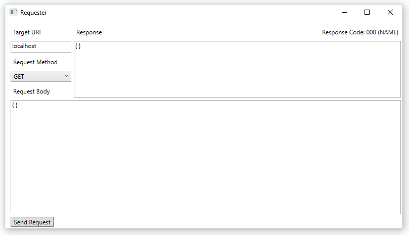

# Requester
Requester is an open-source tool for making HTTP requests.

It is mainly intended for testing REST APIs, but can be used for testing any sort of system accepting HTTP requests.

# Tutorial
## Sending an HTTP request

1. Fill out the "Target URI" box. This does not need to be a fully-qualified name, however if the name is not preceded with "http://" or "https://", "https://" will be automatically appended to the front.
2. Set your request method. Currently, the methods are GET, PUT, POST, and DELETE.
3. Fill out the request body. This is the data sent to the server along with a POST or PUT request. GET and DELETE do not send any body data.
4. Click the "Send Request" button. This will send your request to the target URI, and output the response body in the "Response" box, as well as show the status code in the upper right corner. Note: If an error occurs with the request itself, the response code will be set to "ERROR (0)" and more info about the error will be printed to the response box.

# Contributing
If you would like to add/request a feature, fix/report a bug, or otherwise contribute to the app, open an issue describing what the feature/bug/whatever is. 

To contribute, assign yourself to an issue, fix the issue, and then submit a pull request.